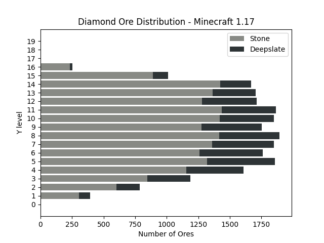
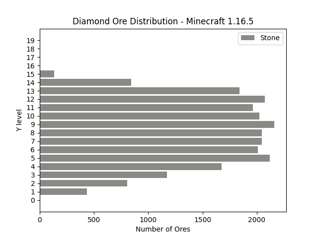

Generated seeds between `1` and `12` using 1.17 and 1.16.5. For each seed server was started, generated initial 23x23 chunks and then stopped.

# 1.17

# 1.16.5

#### Raw data
[   0  434  806 1171 1673 2120 2008 2044 2047 2162 2025 1965 2074 1841  840  134    0    0    0    0]

# Required files:
### /jars/minecraft_server.{version}.jar
Download from https://www.minecraft.net/en-us/download/server

### /noxitu/minecraft/map/blocks.json
Generate using `java -cp minecraft_server.jar net.minecraft.data.Main --all`
Read more: https://wiki.vg/Data_Generators